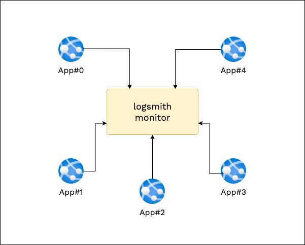

# logsmith-monitor

A stand-alone logging Server for  multi-component apps. Move logging out of your apps and let logsmith-monitor handle and store them for you.

Logsmith-Monitor lets you detache your Apps and Logs to give a hassle free logging experience. Different running components of your app that publish logs can push them into a central logging server - logsmith-monitor, making monitoring across components easier.

<div align="center">

</div>

## Getting Started

To get started with logsmith-monitor, clone this repo and install the dependancies. Once the dependancies are in place, Run the Express Server
```
node .
```

Docker based deployment will be added soon for easy start-up. Read for more options and configurations [here](./documentation/README.md).